

# Clint Browser

**Customizable Layered Internet Navigation Tool**

A privacy‑first Android browser built on Android WebView — no Google telemetry, no tracking, no compromises.

---

## What is Clint?

Clint is a free, open‑source Android browser that puts privacy control in your hands — and lets you tailor the entire look and feel to your taste. It blocks trackers and analytics at the network level, supports DNS over HTTPS, isolates incognito sessions completely, and ships with zero Google telemetry baked in. Every feature is built with the philosophy that your browsing data belongs to you — and only you.

Built and maintained by **[@jhaiian](https://github.com/jhaiian)** — a solo developer from the Philippines 🇵🇭

---

## Screenshots

<table>
  <tr>
    <td align="center">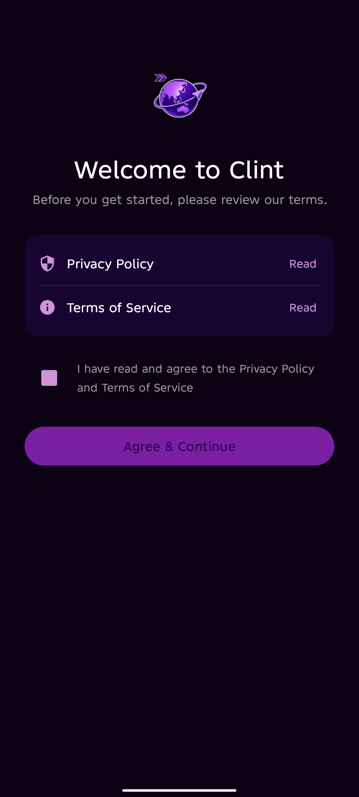 Welcome</td>
    <td align="center">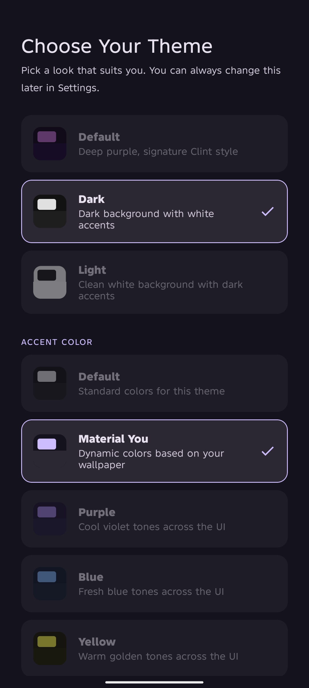 Theme Setup</td>
    <td align="center">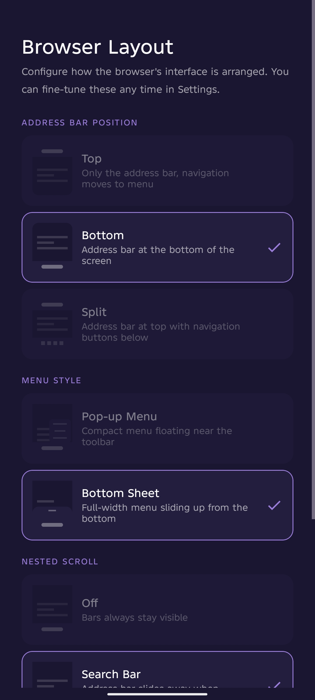 Browser Layout</td>
    <td align="center">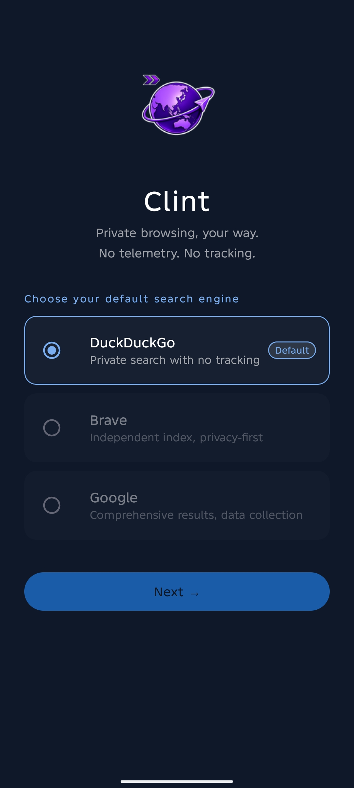 Search Engine Setup</td>
    <td align="center">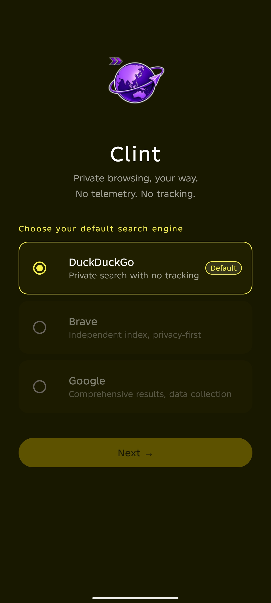 Accent Colors</td>
  </tr>
  <tr>
    <td align="center">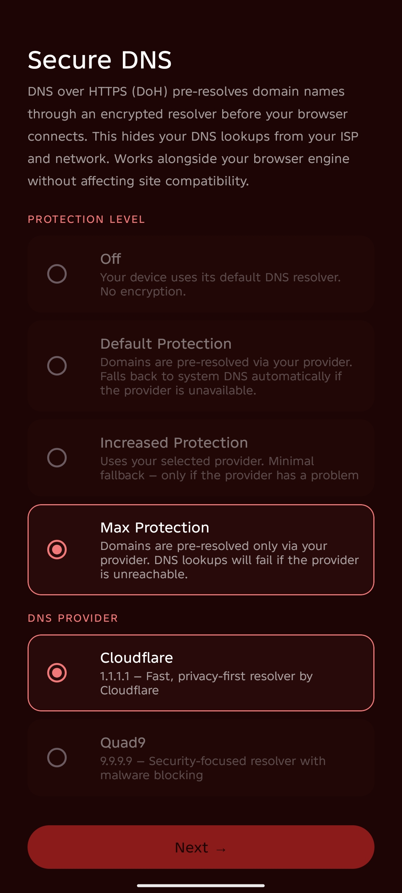 Secure DNS</td>
    <td align="center">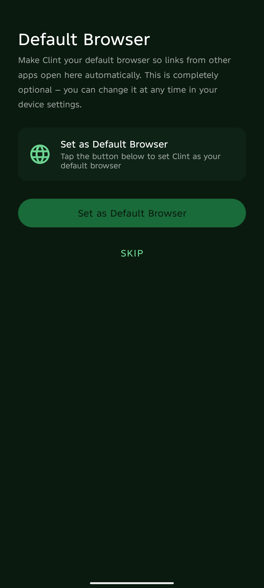 Default Browser</td>
    <td align="center">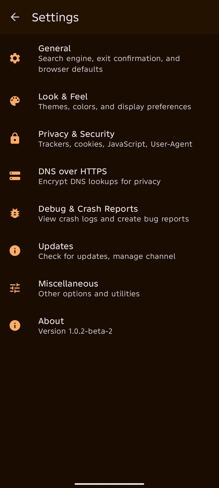 Settings</td>
    <td align="center">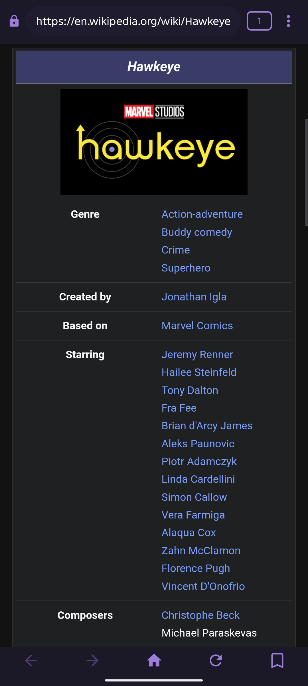 Browsing</td>
    <td align="center">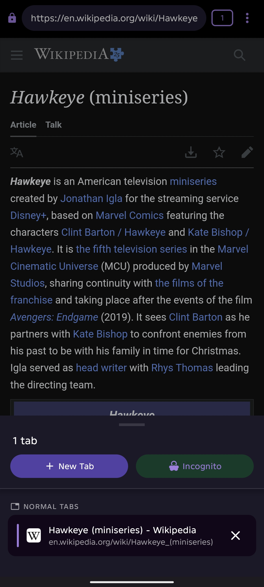 Tab Switcher</td>
  </tr>
  <tr>
    <td align="center">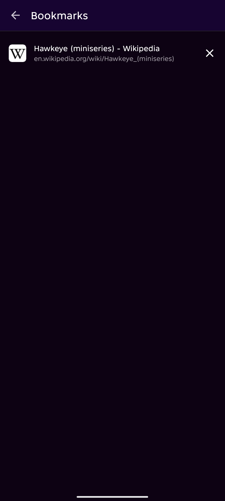 Bookmarks</td>
    <td align="center">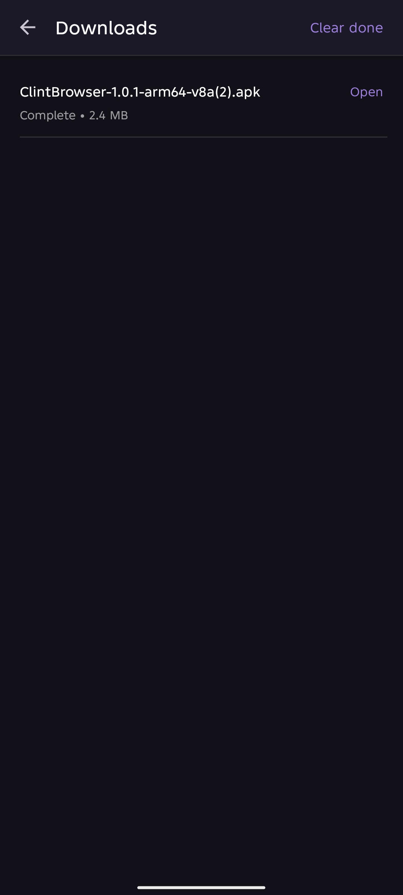 Downloads</td>
  </tr>
</table>

---

## Features

### 🌐 Browser Core
- Multi‑tab browsing with a bottom sheet tab switcher, with clear separation of normal and incognito tabs.
- Incognito mode — fully isolated session: no cookies, cache, or history saved.
- Pull‑to‑refresh with smart detection for nested scrollable content.
- Configurable toolbar visibility:
  - **Nested Scroll** controls exactly which bars hide on scroll:
    - *Off* – both bars always visible
    - *Search Bar* – address bar/toolbar hides when scrolling down
    - *Navigation Bar* – bottom navigation hides (Split mode only)
    - *Both* – both bars hide (Split mode only)
  - See **Look & Feel** for the full set of bar‑position and scroll options.
- **Hide Status Bar** option for immersive full‑screen browsing (off by default).
- Desktop Mode toggle with JavaScript injection.
- Address bar with select‑all on focus.
- Back, forward, refresh, and home navigation.
- Intent handling — links open installed apps (YouTube, Spotify, etc.) with a prompt to choose between external app or staying in‑app.
- **"Open in ___"** button in the menu (grayed out when no compatible app is available).
- Full‑screen video and media support.

### 🗂️ Tab Switcher & Favicons
- Tabs display the website’s own favicon instead of a generic icon.
- Bookmark pages automatically receive their favicon.
- Normal and Incognito tabs are visually separated with clear headers.
- The favicon system uses direct website icons first, with DuckDuckGo as a privacy‑friendly fallback — **no Google services involved**.

### 📎 Uploads
- Upload images, videos, audio, and recordings directly from the browser.

### 🔖 Bookmarks
- Save any page with a single tap from the navigation bar; the bookmark icon updates live to reflect the saved state.
- View, open, and delete bookmarks from a dedicated screen.
- All bookmarks are stored locally on your device — never synced or uploaded.

### 🔒 Privacy & Security
- **Tracker blocking** — 16+ known analytics and ad domains blocked at the network level.
- **Third‑party cookie blocking** — prevents cross‑site tracking.
- **Generic User‑Agent** — reduces browser fingerprinting.
- **DNS over HTTPS (DoH)** — four protection levels with Cloudflare and Quad9 support.
- **SSL enforcement** — invalid certificates are always rejected, no exceptions.
- **Incognito isolation** — separate cookie, cache, and DNS context for each incognito tab.
- **Favicon privacy** — favicons are obtained directly from the visited site or through DuckDuckGo’s service.

### 🔍 Search Engines
- DuckDuckGo (default)
- Brave Search
- Google *(with privacy warning)*
- Change at any time from Settings → General

### ⬇️ Downloads
- Custom download engine built on OkHttp — no reliance on the system DownloadManager.
- Real‑time progress with percentage and file size.
- Cancel downloads in‑app or from the notification.
- Open completed files directly from the downloads screen.
- Install APK files straight from the downloads screen.
- Automatic duplicate filename handling.

### 🎨 Look & Feel
The dedicated **Look & Feel** section in Settings gives you full control over the interface:

#### Theme
- 🟣 **Default** – Deep purple, signature Clint style
- 🌙 **Dark** – Dark background with white accents
- ⚪ **Light** – Clean white background with dark accents

#### Accent Color
Choose an accent that tints backgrounds and UI elements (in Dark/Light themes) or icons & dialogs (in Default theme).
- **Default** – standard theme colors
- **Material You** – dynamic colors from your wallpaper
- **Purple**, **Blue**, **Yellow**, **Red**, **Green**, **Orange** – each with its own vibe

#### Surface Intensity
Controls how strong the background tone appears:
- **Soft Tint** – subtle, gentle background
- **Strong Tint** – deep dark surfaces, higher contrast
- **Pure Mode** – black or white surfaces for maximum contrast

> ℹ️ Some combinations are limited:  
> - Default accent: only Soft Tint and Pure Mode  
> - Material You: Strong Tint unavailable (system limitation)  
> - Default theme: Surface Intensity is not applied (keeps the original style)

#### Address Bar Position
- **Top** – address bar only; navigation moves to the menu
- **Bottom** – address bar at the bottom of the screen (navigation also moves to the menu)
- **Split** – address bar top, navigation buttons below

#### Menu Style
- **Pop‑up Menu** – compact floating menu near the toolbar
- **Bottom Sheet** – full‑width menu sliding up from the bottom

#### Nested Scroll
Controls exactly which bars hide while you scroll. Available modes:
- **Off** – bars always visible
- **Search Bar** – toolbar hides on scroll
- **Navigation Bar** – bottom bar hides on scroll (Split mode only)
- **Both** – both bars hide (Split mode only)

All these options combine to give you **~52 distinct theme combinations**, and the Setup Wizard lets you pick your base theme from the start.

### 🔄 Updates
- In‑app update checker for **Stable** and **Beta** channels.
- Installs updates directly with a progress dialog.
- Architecture‑aware APK download.
- Optional check on launch, with an option to skip on metered connections.
- **View Changelog** button inside update settings.

### 🐛 Debug & Crash Reports
- Local crash log viewer — everything stays on your device, nothing is transmitted.
- Automatically captures stack traces, device info, and timestamps when a crash occurs.
- One‑tap copy of crash logs and a pre‑filled GitHub issue template.
- Reports auto‑deleted after 7 days.

---

## DNS over HTTPS

Clint supports four DoH protection levels:

| Mode | Behavior |
|---|---|
| **Off** | System DNS resolver, no encryption |
| **Default** | Pre‑resolves via your provider, falls back to system DNS if unavailable |
| **Increased** | Pre‑resolves via your provider, minimal fallback |
| **Max** | Only your provider — DNS fails if the provider is unreachable |

**Providers:** Cloudflare (`1.1.1.1`) and Quad9 (`9.9.9.9`)

---

## Requirements

- Android 8.0 (API 26) or higher
- Android System WebView (pre‑installed on all Android devices)

---

## Installation

Download the latest APK from the [Releases](https://github.com/jhaiian/ClintBrowser/releases) page.

Choose the APK that matches your device architecture:

| APK | Devices |
|---|---|
| `arm64‑v8a` | Most modern Android phones (recommended) |
| `armeabi‑v7a` | Older 32‑bit ARM devices |
| `x86_64` | x86 64‑bit devices and emulators |
| `x86` | x86 32‑bit devices and emulators |
| `universal` | All architectures (larger file size) |

Not sure which one to use? Grab the **Universal** APK.  
*(At the moment there’s no native library, so all APKs are functionally identical — the workflow is already in place for future updates.)*

---

## Contributing

Contributions, bug reports, and feature requests are welcome.

1. [Open an issue](https://github.com/jhaiian/ClintBrowser/issues) to report a bug or suggest a feature.
2. Fork the repo and create a branch for your change.
3. Submit a pull request with a clear description.

To report a crash, use the built‑in **Debug & Crash Reports** screen. It generates a pre‑filled GitHub issue template with your device info and crash log. For more details, see [Contributing.md](https://github.com/jhaiian/ClintBrowser/blob/main/Contributing.md).

---

## Community

Join the official Clint Browser community on Discord and Reddit to share feedback, report bugs, and connect with other users.

- **Discord** – [discord.gg/4kUe4yPQ32](https://discord.gg/4kUe4yPQ32)
- **Reddit** – [reddit.com/r/ClintBrowser](https://reddit.com/r/ClintBrowser)

---

## License

Clint Browser is licensed under the **GNU General Public License v3.0**.  
You are free to use, study, modify, and distribute this software under the same license.  
See [LICENSE](LICENSE) for the full text.

---

## Legal

- [Privacy Policy](PRIVACY_POLICY.md)
- [Terms of Service](TERMS_OF_SERVICE.md)