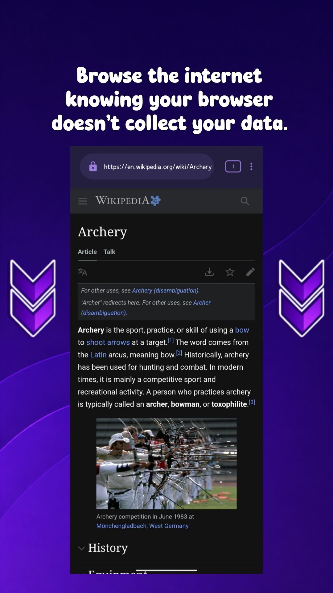
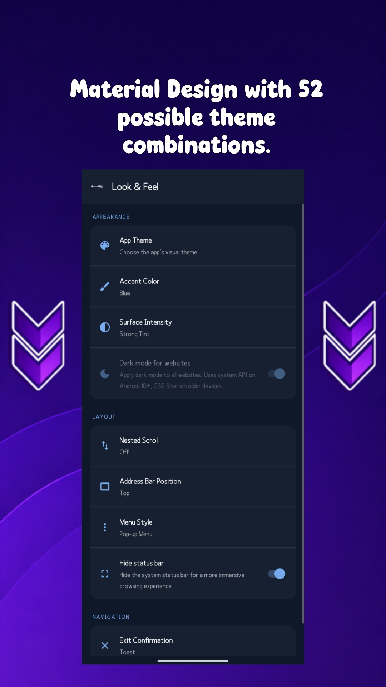
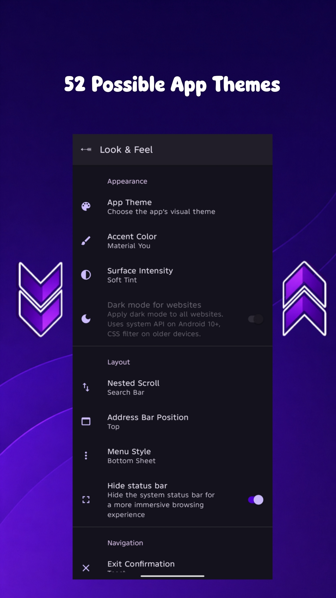
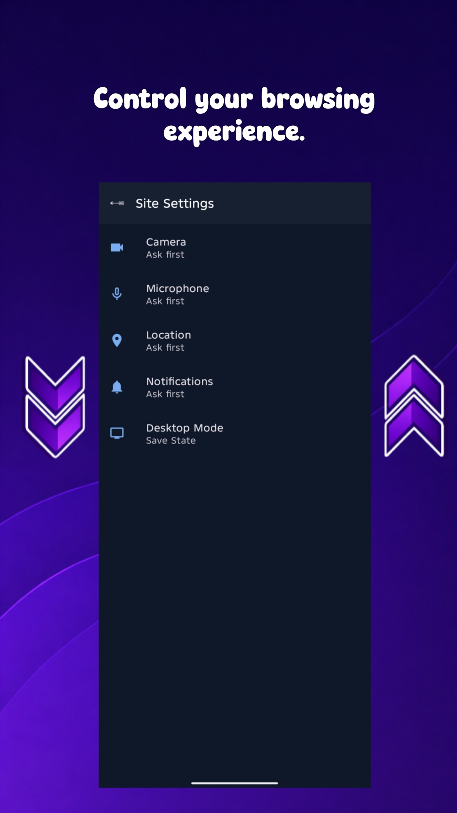

# Clint Browser

**Customizable Layered Internet Navigation Tool**

Material Design Android Browser with ADM and a Content Blocker

---

## What is Clint?

Clint is a free and open-source Android browser with no dedicated backend infrastructure, meaning it does not collect any of your data. It features a clean, customizable Material Design interface, the built-in Quiver Guard content blocker for ads and trackers, and an advanced download manager and website blocker.

Built and maintained by **[@jhaiian](https://github.com/jhaiian)** — a solo developer from the Philippines 🇵🇭

---

## Screenshots

  <table>
    <tr>
      <td align="center"></td>
      <td align="center"></td>
    </tr>
    <tr>
      <td align="center"></td>
      <td align="center"></td>
    </tr>
  </table>

---

## Features

### 🌐 Browser

- Multi-tab browsing
- Incognito mode
- Reader Mode
- Desktop Mode
- Popup protection
- Data Saver

### 🛡️ Quiver Guard

- Built-in ad and tracker blocker
- Cosmetic and network filtering
- Multiple filter lists
- Per-site controls

### 🚫 Website Blocker

- Blocks pornography, gambling, and other unwanted categories
- Category-based filter lists (abuse, ads, crypto, drugs, fraud, gambling, and more)
- Add your own custom websites to block

### 📜 User Scripts

- Install userscripts from a URL or write your own with a built-in code editor
- Tampermonkey-style metadata support (`@match`, `@include`, `@exclude`, `@require`, `@resource`, `@grant`)
- GM API support, including `GM.setValue`/`GM.getValue`, `GM.xmlHttpRequest`, and `GM.notification`
- Automatic update checks for scripts installed from a URL
- Enable or disable individual scripts at any time

### ⬇️ Download Manager

- Multi-threaded and multi-part downloads
- Pause and resume
- Download scheduler
- Speed limiter
- Custom download locations

### 🎨 UI & Customization

Clint is built with **Material 3** and **Jetpack Compose**, with a highly customizable interface.

- 50 accent colors
- Light and Dark themes
- 5 surface intensities
- **In total, 500 possible theme combinations**

### 🔖 Bookmarks & History

- Local bookmarks and browsing history
- Sorting and management options
- Automatic favicons

### 🔐 Site Settings

- Camera, microphone, location, and notification controls
- Per-site permission settings

> Just download the app and explore it yourself.

---

## Donations

I don't want to work for a corporation. I want to keep doing what I love: building apps like Clint and making them freely available to everyone.

If I wanted to, I could make Clint freemium and put some features behind a paywall. Instead, I choose not to because that's simply not the kind of developer I want to be.

If you enjoy Clint and want to support its development, consider making a donation. Every contribution, big or small, helps me continue developing and improving Clint while I'm still in college.

Any amount helps, and if you'd like, you can also get a shoutout as a supporter.

Thanks for helping me keep Clint free and independent.

---

## Requirements

- Android 8.0 (API 26) or higher
- WebView Implementation

---

## Installation

Download the latest APK from the [Releases](https://github.com/jhaiian/ClintBrowser/releases) page.

---

## Contributing

Contributions, bug reports, and feature requests are welcome.

1. [Open an issue](https://github.com/jhaiian/ClintBrowser/issues) to report a bug or suggest a feature.
2. Fork the repo and create a branch for your change.
3. Submit a pull request with a clear description.

To report a crash, use the built‑in **Debug & Crash Reports** screen. It generates a pre‑filled GitHub issue template with your device info and crash log. For more details, see [Contributing.md](https://github.com/jhaiian/ClintBrowser/blob/main/Contributing.md).

---

## Community

Join the official Clint Browser community on Discord and Reddit to share feedback, report bugs, and connect with other users.

- **Discord** – [discord.gg/4kUe4yPQ32](https://discord.gg/4kUe4yPQ32)
- **Reddit** – [reddit.com/r/ClintBrowser](https://reddit.com/r/ClintBrowser)

---

## License

The source code of this project is licensed under the [GNU General Public License v3.0 (GPLv3)](https://github.com/jhaiian/ClintBrowser/blob/main/LICENSE).  

The names "Clint" and "Clint Browser," the logo, screenshots, and all related branding assets are **trademarks** or **proprietary assets** of the author and are **not licensed under the GPL**. Use of these assets requires explicit permission from the author.

All libraries used in this app have their own licenses. Please comply with their respective license terms. See [Attribution.md](https://github.com/jhaiian/ClintBrowser/blob/main/Attribution.md) for details.

---

## Legal

- [Privacy Policy](PRIVACY_POLICY.md)
- [Terms of Service](TERMS_OF_SERVICE.md)
